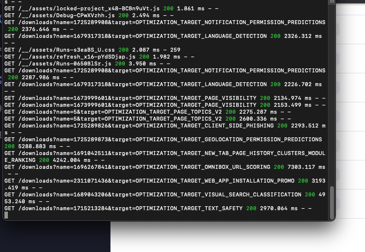
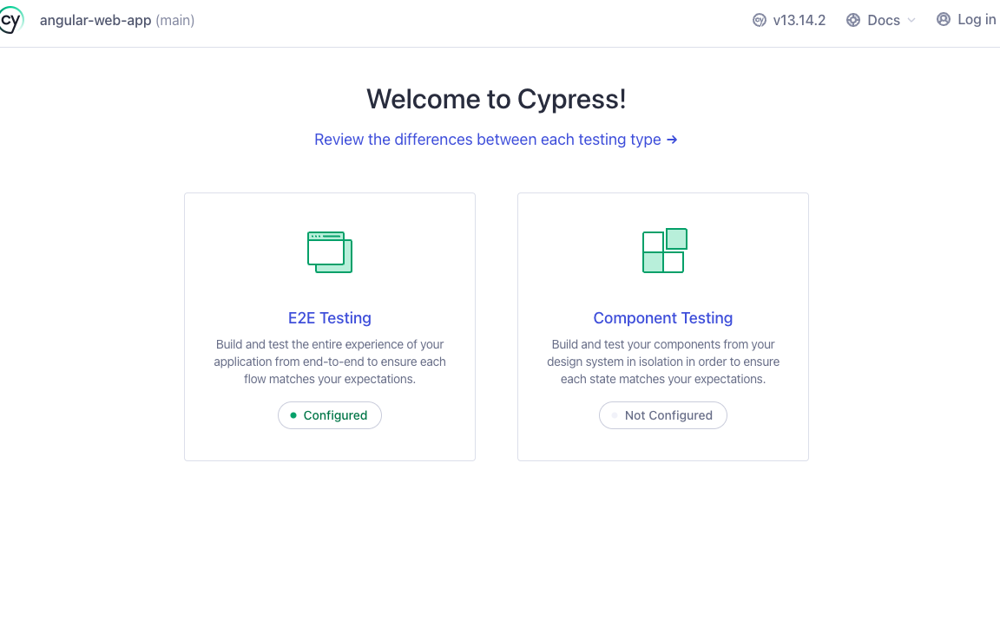
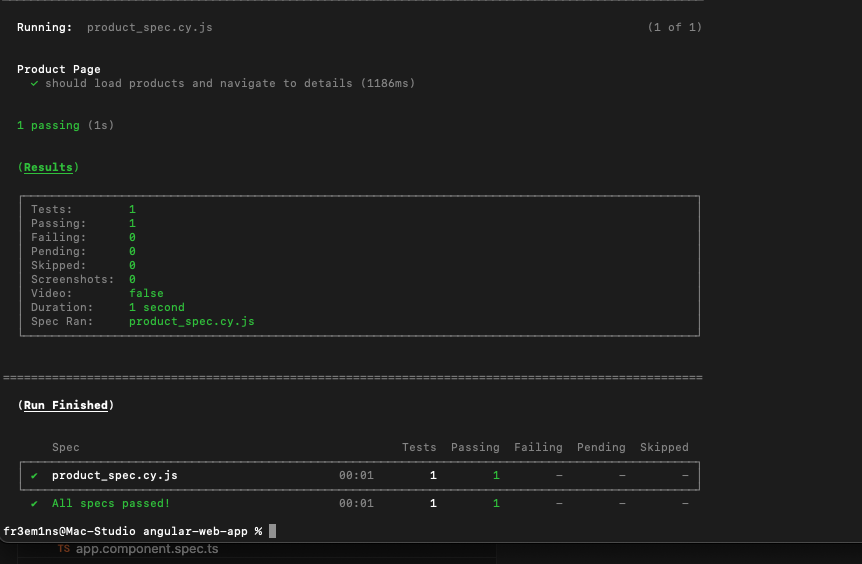

# AngularWebApp

This project was generated with [Angular CLI](https://github.com/angular/angular-cli) version 16.2.16.

## Development server

Run `ng serve` for a dev server. Navigate to `http://localhost:4200/`. The application will automatically reload if you change any of the source files.

## Code scaffolding

Run `ng generate component component-name` to generate a new component. You can also use `ng generate directive|pipe|service|class|guard|interface|enum|module`.

## Build

Run `ng build` to build the project. The build artifacts will be stored in the `dist/` directory.

## Running unit tests

Run `ng test` to execute the unit tests via [Karma](https://karma-runner.github.io).

### Unit Tests

- **ProductService**: Write unit tests to verify data fetching from the API.
- **ProductListComponent**: Write unit tests to ensure the component renders correctly and handles interactions, such as selecting a product.
- **ProductDetailComponent**: Write unit tests to verify that the component displays product details and handles user interactions correctly.

## Running end-to-end tests

Run `ng e2e` to execute the end-to-end tests via a platform of your choice. To use this command, you need to first add a package that implements end-to-end testing capabilities.

### End-to-End Tests

- **Protractor or Cypress**: Create end-to-end tests to verify routing and data fetching. Ensure that:
  - Navigation between the product list and product detail works correctly.
  - The application fetches and displays data as expected.

## Routing Setup

### App Routing Module

```typescript
import { NgModule } from '@angular/core';
import { RouterModule, Routes } from '@angular/router';
import { ProductListComponent } from './product-list/product-list.component';
import { ProductDetailComponent } from './product-detail/product-detail.component';

const routes: Routes = [
  { path: 'products', component: ProductListComponent },
  { path: 'products/:id', component: ProductDetailComponent },
  { path: '', redirectTo: '/products', pathMatch: 'full' },
];

@NgModule({
  imports: [RouterModule.forRoot(routes)],
  exports: [RouterModule]
})
export class AppRoutingModule { }
``````

# Cypress testing:




passed cypress test:

